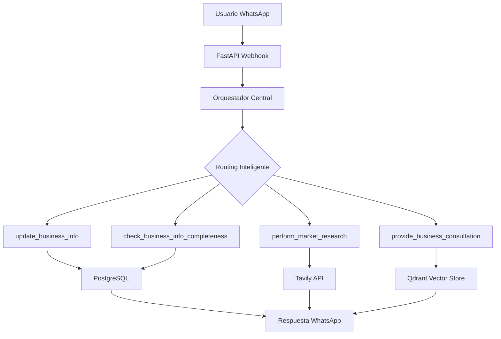

# 🚀 KUMAK - Asistente Empresarial Inteligente para PYMEs

KUMAK es una plataforma de inteligencia artificial especializada en el desarrollo y crecimiento de Pequeñas y Medianas Empresas (PYMEs). Utiliza una arquitectura multi-agente avanzada basada en LangGraph para proporcionar consultoría empresarial personalizada, análisis de mercado e integración con WhatsApp.

## 🌟 Características Principales

### 🤖 Arquitectura Multi-Agente Inteligente
- **Orquestador Central Refinado**: Arquitectura ReAct pura con patrón de herramientas especializadas
- **Agentes Especializados**: Extracción de información, investigación de mercado y consultoría
- **Routing Inteligente**: Detección automática de intenciones y flujo conversacional natural

### 📱 Integración WhatsApp
- Webhook completo para mensajes entrantes y salientes
- Manejo de botones interactivos y respuestas automáticas
- Límite inteligente de tokens para mensajes WhatsApp
- Feature flag para alternar entre arquitecturas

### 🧠 Herramientas Empresariales Especializadas
- **`update_business_info`**: Extracción y almacenamiento de información empresarial
- **`perform_market_research`**: Investigación de mercado personalizada con Tavily
- **`provide_business_consultation`**: Consultoría conversacional especializada
- **`check_business_info_completeness`**: Validación de completitud de datos

### 💾 Persistencia y Memoria
- **PostgreSQL**: Persistencia de estados de conversación con LangGraph
- **Qdrant**: Vector store para memoria semántica a largo plazo
- **Pooling de Conexiones**: Gestión eficiente de recursos de base de datos

## 🏗️ Arquitectura del Sistema



## 🛠️ Tecnologías Utilizadas

- **Framework**: FastAPI + Uvicorn
- **IA**: LangGraph + LangChain + OpenAI GPT-4
- **Bases de Datos**: PostgreSQL + Qdrant
- **Integración**: WhatsApp Business API
- **Investigación Web**: Tavily API
- **Gestión de Dependencias**: Poetry

## 📋 Requisitos Previos

- Python 3.11+
- PostgreSQL 12+
- Cuenta de OpenAI con API key
- WhatsApp Business API (Meta)
- Tavily API key para búsquedas web
- Instancia de Qdrant (local o cloud)

## 🚀 Instalación

### 1. Clonar el repositorio
```bash
git clone https://github.com/tu-usuario/kumak.git
cd kumak
```

### 2. Configurar entorno virtual
```bash
python -m venv .venv
source .venv/bin/activate  # En Windows: .venv\Scripts\activate
```

### 3. Instalar dependencias
```bash
pip install -r requirements.txt
# O usando Poetry:
poetry install
```

### 4. Configurar variables de entorno
Crea un archivo `.env` en la raíz del proyecto:

```env
# PostgreSQL
POSTGRES_HOST=localhost
POSTGRES_PORT=5432
POSTGRES_USER=postgres
POSTGRES_PASSWORD=tu_password
POSTGRES_DB=kumak_db

# OpenAI
OPENAI_API_KEY=sk-tu-api-key

# Qdrant
QDRANT_URL=https://tu-qdrant-url
QDRANT_API_KEY=tu-qdrant-api-key

# Tavily (búsquedas web)
TAVILY_API_KEY=tu-tavily-api-key

# WhatsApp Business API
WHATSAPP_TOKEN=tu-whatsapp-token
WHATSAPP_PHONE_NUMBER_ID=tu-phone-number-id
WHATSAPP_VERIFY_TOKEN=tu-verify-token

# API Settings
API_HOST=0.0.0.0
API_PORT=9027
API_WORKERS=2
LOG_LEVEL=INFO

# LLM Settings
LLM_MODEL=gpt-4o-mini
LLM_MODEL_LARGE=gpt-4o
```

### 5. Inicializar base de datos
```bash
python -m app.database.init_db
```

## 🎯 Uso

### Ejecutar el servidor
```bash
# Desarrollo
python main.py

# Producción con Uvicorn
uvicorn main:app --host 0.0.0.0 --port 9027 --workers 2
```

### Endpoints principales
- **Webhook WhatsApp**: `POST /whatsapp/webhook`
- **Chat directo**: `POST /chat/message`
- **Health check**: `GET /health`
- **Documentos**: `POST /documents/upload`

### Ejemplo de uso con chat directo
```bash
curl -X POST "http://localhost:9027/chat/message" \
     -H "Content-Type: application/json" \
     -d '{
       "message": "Tengo una pollería familiar que está creciendo. ¿Cómo puedo expandir mi negocio?",
       "thread_id": "test_user_123"
     }'
```

## 🔧 Configuración Avanzada

### Feature Flags
- `USE_CENTRAL_ORCHESTRATOR=True`: Activa la nueva arquitectura central
- Puedes cambiar entre arquitecturas modificando esta variable

### Límites y Optimizaciones
- **Max tokens WhatsApp**: 150 tokens por mensaje
- **Pool de conexiones DB**: 10 conexiones por defecto
- **Timeout**: 30 segundos por consulta

### Logging
El sistema incluye logging estructurado con niveles configurables:
```python
LOG_LEVEL=DEBUG  # DEBUG, INFO, WARNING, ERROR
```

## 🧪 Testing

```bash
# Ejecutar pruebas básicas
python test_async_fix.py
python test_business_info_state.py
python test_fixed_supervisor.py

# Simular conversación empresarial
python simulate_business_context.py

# Debug flujo WhatsApp
python debug_whatsapp_flow.py
```

## 📁 Estructura del Proyecto

```
kumak/
├── app/
│   ├── config/          # Configuración y variables de entorno
│   ├── database/        # Conexiones y modelos de BD
│   ├── graph/          # Arquitectura multi-agente (LangGraph)
│   ├── routers/        # Endpoints FastAPI
│   ├── services/       # Lógica de negocio y servicios
│   └── utils/          # Utilidades generales
├── tests/              # Scripts de prueba
├── main.py            # Punto de entrada de la aplicación
├── requirements.txt   # Dependencias
└── README.md         # Este archivo
```

## 🤝 Contribuir

1. Fork el proyecto
2. Crea una rama para tu feature (`git checkout -b feature/nueva-caracteristica`)
3. Commit tus cambios (`git commit -am 'Agrega nueva característica'`)
4. Push a la rama (`git push origin feature/nueva-caracteristica`)
5. Abre un Pull Request

## 📜 Licencia

Este proyecto está licenciado bajo la Licencia MIT. Ver el archivo `LICENSE` para más detalles.

## 🆘 Soporte

Para reportar bugs o solicitar características:
- Abre un issue en GitHub
- Contacta al equipo de desarrollo

## 📚 Documentación Adicional

- [Guía de Desarrollo](docs/DEVELOPMENT.md)
- [API Reference](docs/API.md)
- [Arquitectura Multi-Agente](docs/ARCHITECTURE.md)
- [Integración WhatsApp](docs/WHATSAPP.md)

---

**KUMAK** - Impulsando el crecimiento de PYMEs a través de inteligencia artificial 🚀 