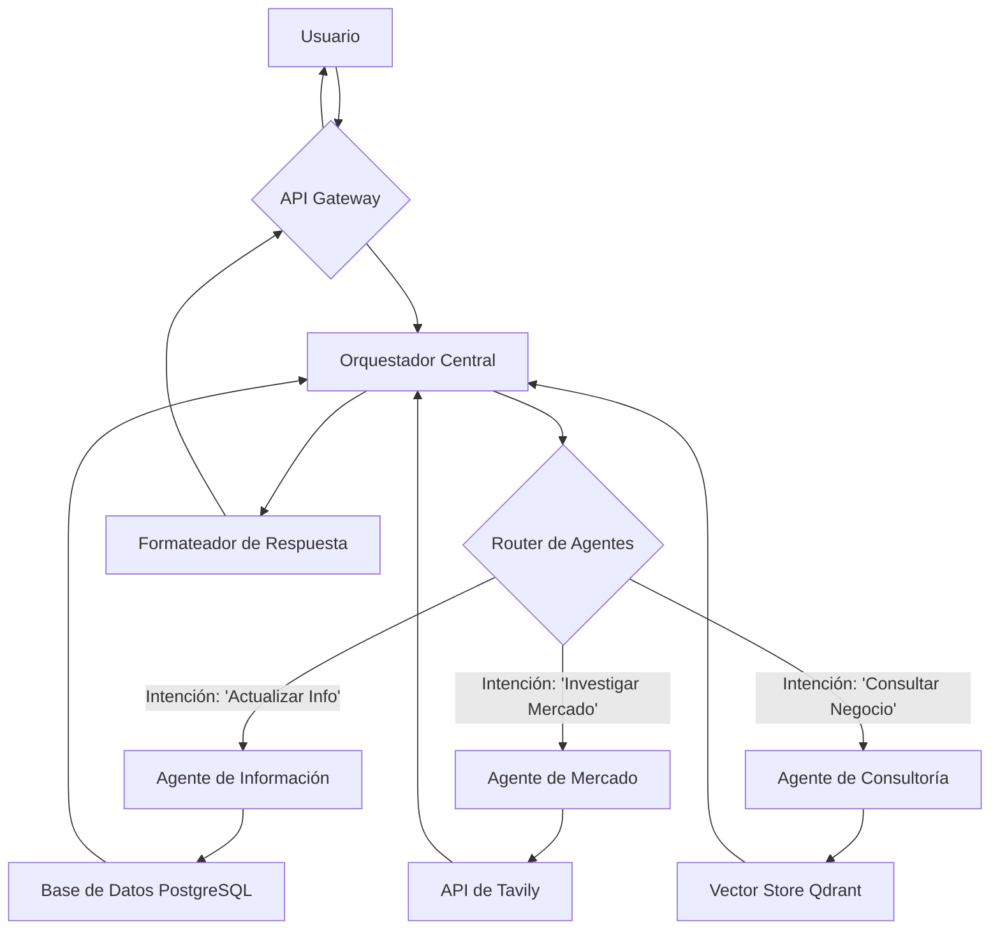

# 🏗️ Arquitectura Multi-Agente

KUMAK utiliza una arquitectura de software avanzada que organiza la lógica de negocio en **agentes especializados**, cada uno responsable de una tarea específica. Esta modularidad permite que el sistema sea más fácil de mantener, escalar y mejorar.

## 🤖 Agentes Especiales

A continuación, se describen los agentes que componen el sistema y sus responsabilidades:

### 1. 🧠 Orquestador Central (ReAct)

- **Descripción**: Es el cerebro del sistema. Recibe los mensajes del usuario y decide qué herramienta o agente es el más adecuado para responder.
- **Funcionamiento**: Utiliza un patrón **ReAct (Reasoning and Acting)**, que le permite razonar sobre la intención del usuario y actuar en consecuencia, seleccionando la herramienta más apropiada para la tarea.
- **Inteligencia**: Implementado con `LangGraph`, es capaz de gestionar conversaciones complejas y mantener el contexto a lo largo del tiempo.

### 2. 📝 `update_business_info`

- **Propósito**: Extraer y almacenar información clave sobre el negocio del usuario.
- **Funcionamiento**: Cuando un usuario proporciona detalles sobre su empresa (nombre, sector, objetivos, etc.), este agente se activa para identificar y guardar estos datos en la base de datos **PostgreSQL**.
- **Ejemplo**: Si un usuario dice: "Mi empresa se llama 'Pollos Hermanos' y nos dedicamos a la venta de pollo frito", el agente extraerá "Pollos Hermanos" como el nombre y "venta de pollo frito" como la descripción del negocio.

### 3. 📈 `perform_market_research`

- **Propósito**: Realizar investigaciones de mercado utilizando fuentes de datos externas.
- **Funcionamiento**: Se integra con la **API de Tavily** para realizar búsquedas web y recopilar información relevante sobre competidores, tendencias del mercado y oportunidades de negocio.
- **Ejemplo**: Si un usuario pregunta: "¿Cuáles son las últimas tendencias en el mercado de comida rápida?", este agente buscará en la web para proporcionar una respuesta actualizada.

### 4. 💼 `provide_business_consultation`

- **Propósito**: Ofrecer consultoría y recomendaciones de negocio.
- **Funcionamiento**: Utiliza la información almacenada sobre el negocio y el contexto de la conversación para generar consejos personalizados. Se apoya en un **vector store en Qdrant** para recuperar información relevante de conversaciones pasadas y documentos.
- **Ejemplo**: Ante la pregunta "¿Cómo puedo expandir mi negocio de pollos?", el agente podría sugerir estrategias de marketing, apertura de nuevas sucursales o diversificación de productos.

### 5. ✅ `check_business_info_completeness`

- **Propósito**: Validar que la información del negocio esté completa.
- **Funcionamiento**: Antes de ofrecer consultoría, este agente verifica si se han recopilado todos los datos necesarios sobre el negocio. Si falta información, interactúa con el usuario para obtenerla.
- **Ejemplo**: Si un usuario pide un plan de negocio sin haber proporcionado el nombre de su empresa, el agente responderá: "Para ayudarte mejor, ¿podrías decirme el nombre de tu empresa?".

## 🌊 Flujo de Datos

El siguiente diagrama ilustra cómo interactúan los agentes y los componentes del sistema:

Este diseño modular y especializado permite a KUMAK ofrecer un servicio de consultoría robusto, flexible y altamente personalizado para las necesidades de cada PYME.